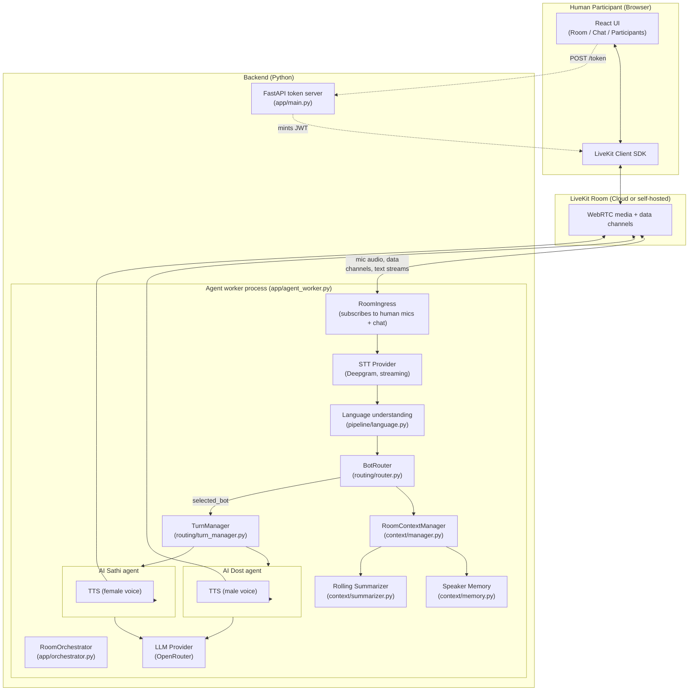

# Architecture

## Overview

Roxstar AI Voice Room is a LiveKit-based realtime room. Two or more humans
join with microphone and text chat; two independently-connected AI
participants — **Roxstar AI Dost** (male, practical/technical persona) and
**Roxstar AI Sathi** (female, warm/example-driven persona) — listen, decide
whether and who should respond, and speak back in Hindi/Hinglish.

The system is explicitly **not** `Human → LLM → response`. It is a pipeline
with a router and a shared context store sitting between speech and
generation, so that:

- only one bot ever answers a given turn (never both, never neither when a
  reply is warranted, per the routing strategy),
- every bot's reply is grounded in the *same* shared conversation state,
  regardless of whether it arrived as voice or as text,
- a human can interrupt a bot mid-sentence and get a fast, clean cut.

## Component diagram

## Two independent LiveKit connections, one shared brain

AI Dost and AI Sathi are **genuine, separately-authenticated LiveKit
participants** — each holds its own `rtc.Room` connection, publishes its own
microphone-source audio track, and carries its own `role=bot` / `bot_id`
attributes that the UI reads to render it (no participant is ever faked in
the UI; see `frontend/src/services/livekit.js`).

They are not, however, two independent bots each running their own loop.
Inside one Python process (`app/orchestrator.py`), both agents share:

| Shared component | Why it must be shared |
|---|---|
| `RoomContextManager` | One transcript, one topic, one memory store — otherwise Sathi would not know what Dost just said, breaking multi-user/multi-bot context. |
| `BotRouter` | Selection happens once, centrally, before any generation — this is what guarantees only one bot answers. |
| `TurnManager` | A single "floor" lock across both bots — this is what guarantees no audio overlap. |
| `MemoryStore` | Keyed by LiveKit participant identity, not by which bot is asked — Rahul's facts must be the same whichever bot answers him. |

Only **one** of the two connections (AI Dost's, called the *primary*) hosts
the `RoomIngress`: it is the one that subscribes to human microphones, runs
STT, and receives chat. This is deliberate — subscribing from both
connections would produce two transcripts of the same sentence. AI Sathi's
connection is audio/chat **egress only**.

## Why bots never hear each other

`RoomIngress._maybe_subscribe` only calls `set_subscribed(True)` on tracks
published by participants whose `attributes.role != "bot"`. Both bots'
`role=bot` attribute is set at token-mint time (`livekit_rt/room.py`) and
re-asserted on connect, so this check does not depend on identity-string
matching that could be spoofed or drift. This structurally prevents a
feedback loop where Dost's TTS audio could be picked up by Sathi's STT (or
vice versa) and treated as a new human utterance.

## Data channels / topics

| Topic | Direction | Payload | Purpose |
|---|---|---|---|
| `lk.chat` | human ⇄ bot | LiveKit text stream | Room text chat. Enters the *same* pipeline as voice (`orchestrator._handle_chat`). Bot replies are also mirrored here. |
| `roxstar.transcript` | bot → humans | JSON data packet | Turn-by-turn transcript (final) + interim voice captions, for the center conversation panel. |
| `roxstar.state` | bot → humans | JSON data packet | Bot states, last routing decision, latency metrics snapshot, interruption count — feeds `BotStatus` and the optional debug panel. |

## Provider abstraction

`STTProvider`, `LLMProvider`, and `TTSProvider` are small ABCs
(`app/pipeline/{stt,llm,tts}.py`). Each has one production implementation
(Deepgram, OpenRouter, ElevenLabs) plus Scripted/Silent/Failing test doubles
used by the automated test suite and as safe offline fallbacks when
credentials are absent. Swapping a vendor means writing one new class and
changing an env var — see `docs/provider-decisions.md`.

## Related docs

- [sequence-diagram.md](sequence-diagram.md) — turn-by-turn message flow, including barge-in
- [routing-strategy.md](routing-strategy.md) — how exactly one bot is chosen
- [context-management.md](context-management.md) — window/summary/memory strategy
- [provider-decisions.md](provider-decisions.md) — why Deepgram / OpenRouter / ElevenLabs
- [failure-handling.md](failure-handling.md) — what happens when a provider fails
- [latency.md](latency.md) — how latency is actually measured
- [limitations.md](limitations.md) — known gaps and their trade-offs
