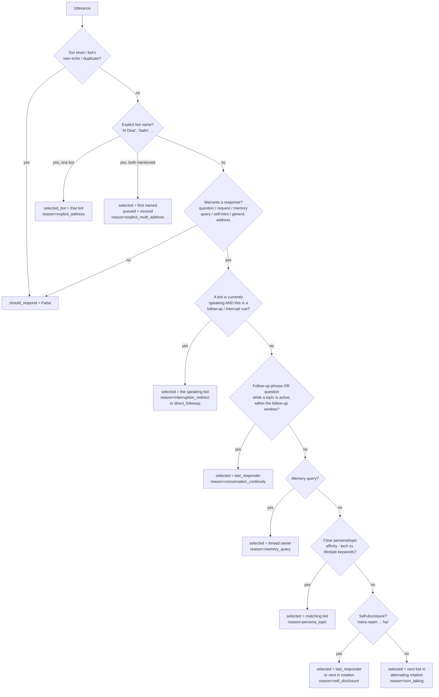

# Routing Strategy

Implementation: [`backend/app/routing/router.py`](../backend/app/routing/router.py)
(`BotRouter`) and [`turn_manager.py`](../backend/app/routing/turn_manager.py)
(`TurnManager`). Tests: [`backend/tests/test_routing.py`](../backend/tests/test_routing.py),
[`test_interruption.py`](../backend/tests/test_interruption.py).

## The two guarantees

1. **At most one bot generates per turn.** The bot is selected *before* any
   LLM call — never by generating two candidate replies and picking one. This
   halves LLM cost/latency for every turn and removes an entire class of
   "which reply do we actually publish" race conditions.
2. **Bots stay silent unless relevant.** A relevance gate runs before bot
   selection; most human-to-human chatter never reaches a bot at all.

## Why deterministic rules, not an LLM router

An LLM-based router would add a full network round trip to the front of
*every* utterance, including ones that turn out to need no response at all —
directly hurting the latency this app is judged on. Deterministic rules are:

- microseconds, not hundreds of milliseconds
- free (no extra API call)
- reproducible and exhaustively unit-testable (all 7 required demo scenarios
  and the failure modes in section 21 of the spec are asserted in CI)
- debuggable: every decision logs its exact matched rule and reason

The trade-off is coverage: a fixed rule set cannot understand truly novel
phrasings the way an LLM could. Section "What this strategy does not handle"
below is honest about where that shows up.

## Rule priority (evaluated in this order)

1. **Explicit address** (`explicit_address` / `explicit_multi_address`) —
   confidence 0.99. Matches "AI Dost", "Roxstar Dost", "dost", "AI Sathi",
   "saathi", Devanagari "दोस्त"/"साथी", and common STT mis-transcriptions
   (`dosth`, `sathee`). Two names mentioned → the *first-named* bot answers
   immediately, the second is queued to speak strictly after
   (`RoutingDecision.queued_bots`), never concurrently.
2. **Direct follow-up / interruption redirect** — if a bot is currently
   speaking and the new utterance is a follow-up phrase or an interrupt cue
   ("ruko", "ek second"), the *same* bot that was speaking picks it back up.
   Redirecting to the other bot mid-answer would be jarring.
3. **Conversation continuity** — a follow-up phrase, or a question while the
   room has an "active topic", within `ROUTER_FOLLOWUP_WINDOW_S` (default 45s)
   of the last bot reply → the bot that owns the thread (`last_responder`)
   continues, **regardless of which human is now speaking**. This is what
   makes Priya's "thoda aur simple batao" after Rahul's question work.
4. **Memory query** — "Maine apne baare mein kya bataya tha?" routes to the
   thread owner (or next-in-rotation if there is none), who then answers
   strictly from *that speaker's own* memory (see context-management.md).
5. **Persona/topic affinity** — a small, deliberately narrow keyword set per
   bot (tech/systems → Dost, movies/food/daily-life → Sathi). Only fires when
   one bot's keyword count is both ≥2 and at least double the other's, to
   avoid feeling arbitrary on ambiguous sentences.
6. **Self-disclosure acknowledgement** — "Mera naam Rahul hai..." gets a short
   acknowledgement from the thread owner (or rotation), not silence and not a
   lecture.
7. **Turn-taking fallback** — an unaddressed, on-topic question with no other
   signal alternates between Dost and Sathi (seeded on Dost), so one bot never
   monopolises the room.

## The relevance gate (before any of the above)

A bot responds only if the utterance is a question/request word match, a
memory query, a self-disclosure, an explicit/generic bot address, or a
follow-up inside an active, still-fresh thread. Pure small talk ("haan",
"thanks", "waise aaj weather achha hai") is recognized by pattern and
produces `should_respond=False` with no further processing.

## Guards against double/duplicate responses

- **Bot self-echo**: any transcript whose speaker identity matches one of the
  two bots' own LiveKit identities is dropped before rule evaluation — without
  this, an imperfect subscription filter could make Dost and Sathi talk to
  each other forever.
- **Duplicate suppression**: the same speaker repeating the same normalized
  text within a short window (STT sometimes re-emits a final transcript) is
  suppressed rather than answered twice.
- **`RoutingDecision.__post_init__` invariant**: if `should_respond` is
  `False`, `selected_bot` and `queued_bots` are forced to `None`/`()` even if
  a caller passed something else — a structural guarantee, not just a
  convention, verified in `test_routing.py::TestInvariant`.
- **`TurnManager`** (not the router) is what makes "only one bot speaks at a
  time" true at the audio level: it is a single-floor lock shared by both
  agents. A second bot's turn is either queued (runs strictly after) or, for
  a barge-in, the first is cancelled and its floor released *before* the
  second is allowed to start — see `docs/architecture.md` and
  `test_interruption.py::TestEndToEndBargeIn`.

## What this strategy does not handle

- Genuinely novel ways of naming a bot that don't match the term list (e.g. a
  nickname nobody anticipated) fall through to turn-taking rather than
  explicit addressing.
- Persona/topic affinity is intentionally conservative; most everyday
  questions ("AI kya hota hai?") have no strong lean and correctly fall to
  turn-taking rather than a topic guess.
- The follow-up window is time-based (45s default), not turn-count-based; a
  very slow-paced conversation could have a follow-up "expire" and get
  re-routed by turn-taking instead of continuing with the same bot. This is a
  deliberate, tunable trade-off (`ROUTER_FOLLOWUP_WINDOW_S`), not a bug.
