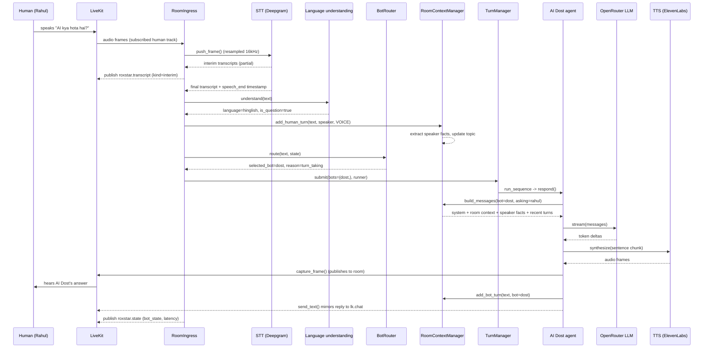
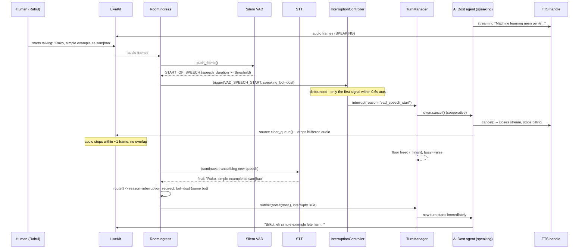
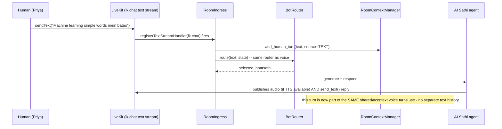
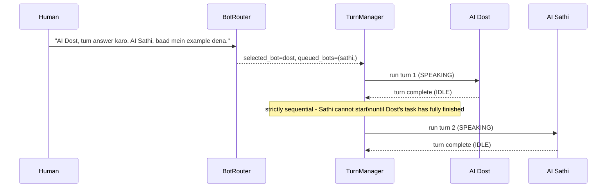

# Sequence Diagrams

## 1. Normal voice turn (no interruption)

## 2. Barge-in / interruption

Three independent detection signals feed the same debounced
`InterruptionController.trigger()`, from fastest-but-noisiest to
slowest-but-certain:

1. **VAD start-of-speech** while a bot is `SPEAKING` (~100-300ms)
2. **Interim STT transcript** with ≥2 words, or an explicit cue word
   ("ruko", "stop", "ek second") even as a single word (~300-800ms)
3. **Final STT transcript** while a bot is (still) speaking — the backstop

Only the *first* of these to fire within the 0.6s debounce window actually
cancels; the other two are suppressed logging-only events. See
`app/pipeline/interruption.py`.

## 3. Text chat (same pipeline as voice)

## 4. Explicit two-bot sequencing (no overlap)

